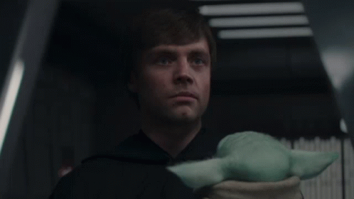

- El camino de los que nunca paran de aprender y que siempre nos superamos.

- Recuerda en la Platzi Conf de México 2023, el CEO de Platzi Freddy Vega dijo
> "A mi me ha resultado efectivo nunca parar de aprender"

- La disciplina vencerá al talento. 
- Recuerda que en el Mandaloriano Luke Skywalker dijo:
> "Talento sin disciplina no sirve"

- Aprender a desaprender. 
- 📚🚀 Una mentalidad de aprendizaje es la llave 🔑 maestra hacia el éxito. Ser ávido de conocimiento te lleva a la cima, te hace competitivo y te empodera para dominar las habilidades que el mercado laboral requiere. Es el motor que impulsa la evolución constante hacia un futuro prometedor. 🌟💡

⚡El desarrollo es intencional, nadie mejora por accidente. 

